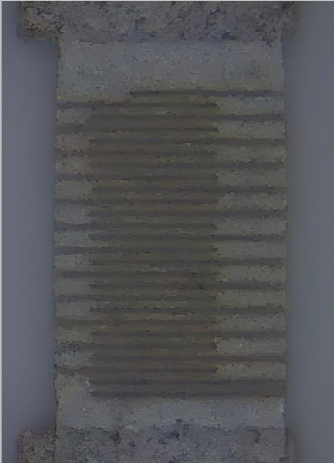
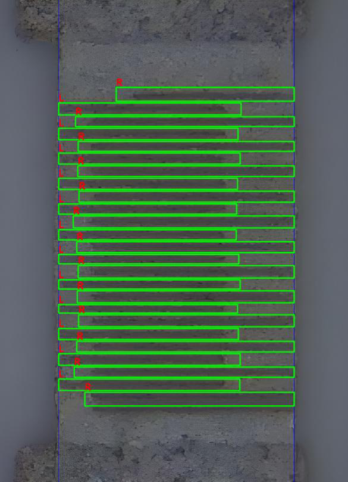
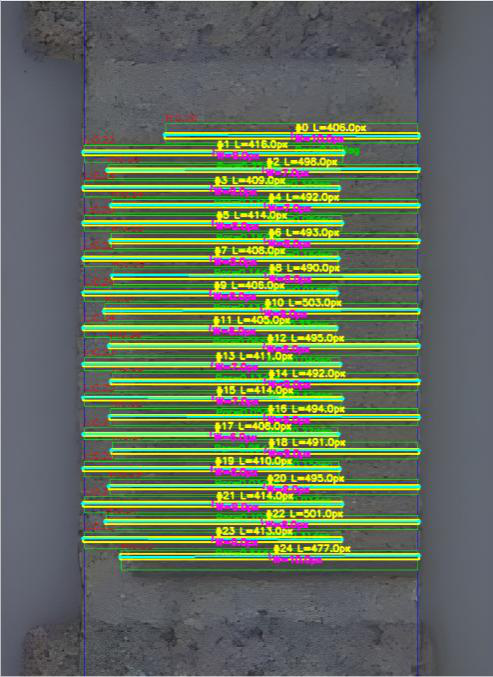
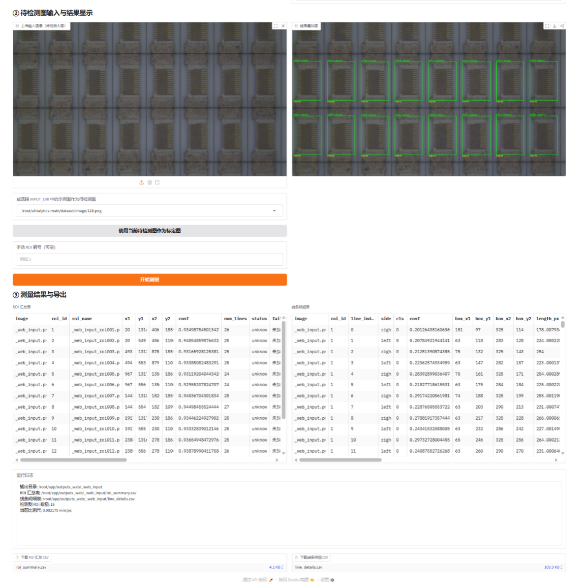
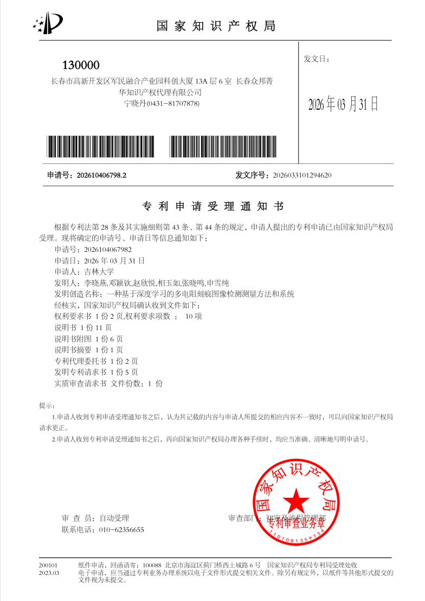

# 面向高精度电阻刻痕检测的人工智能图像识别系统
### 基于 YOLOv11 与 Real-ESRGAN 的微米级视觉测量解决方案

---

**项目周期**：2025 - 2026
**依托单位**：吉林大学通信工程学院 | 长春光华微电子设备工程中心有限公司
**项目编号**：吉林大学“大学生创新创业训练计划”项目（S202510183448）

---

## 1. 项目摘要

本项目针对薄膜电阻激光调阻工艺中，刻痕结构呈现出的细长、低对比度、边缘模糊等特征，以及工业界对微米级精确测量的迫切需求，设计并实现了一套完整的工业视觉检测系统。

系统创新性地采用了“两级检测（YOLOv11）+ 图像增强（Real-ESRGAN）+ 几何拟合测量”的技术路线。通过从“粗定位”到“精测量”的级联架构，不仅解决了传统算法难以同时兼顾多目标检测效率与微小结构测量精度的矛盾，更实现了从单纯的“定性识别”向高精度的“定量测量”跨越，显著提升了电阻产品的质量管控水平。

## 2. 目录

- [项目摘要](#1-项目摘要)
- [核心技术栈](#3-核心技术栈)
- [系统总体架构](#4-系统总体架构)
- [关键技术详解](#5-关键技术详解)
    - [图像增强](#51-图像增强与预处理)
    - [两级检测架构](#52-两级-yolov11-检测架构)
    - [几何测量算法](#53-基于带状投影拟合的测量算法)
- [软件界面与交互](#6-软件界面与交互)
- [项目成果与知识产权](#7-项目成果与知识产权)
- [快速开始](#8-快速开始)

---

## 3. 核心技术栈

- **深度学习框架**：PyTorch, Ultralytics (YOLOv11)
- **图像增强**：Real-ESRGAN (超分辨率重建)
- **几何测量**：带状投影拟合算法 (Banded Projection Fitting)
- **交互界面**：Gradio (Web UI)
- **部署环境**：Python 3.8+

---

## 4. 系统总体架构

如图所示，本系统构建了从物理图像采集到数字化质量判定的完整闭环。整体流程分为 8 个核心阶段：

1. **比例尺标定**：建立像素与物理尺寸（mm）的映射。
2. **电阻区域检测**：在多电阻原图中定位单个电阻（YOLOv11-1）。
3. **单电阻裁剪**：外扩裁剪，保留上下文信息。
4. **图像超分增强**：Real-ESRGAN 提升刻痕边缘清晰度。
5. **刻痕线条检测**：精细化识别刻痕位置（YOLOv11-2）。
6. **候选框后处理**：去重、边界修整、交叠消解。
7. **几何参数测量**：基于带状投影拟合计算长、宽、间距、平行度。
8. **质量判定与展示**：输出 Pass/Fail 结果及可视化报表。


> *图 1：系统“比例尺标定—电阻区域检测—图像增强—刻痕检测—几何测量—质量判定”的完整技术路线*

---

## 5. 关键模块详解

### 5.1 图像增强与预处理
针对刻痕线条低对比度、边缘模糊的问题，引入 Real-ESRGAN 模型。该模型在保留纹理信息的同时，显著提升了图像分辨率，解决了微小刻痕难以分辨的问题，为后续的精确框选奠定了基础。


> *图 2：采用 Real-ESRGAN 对单电阻区域图像进行超分辨增强的示意图*

### 5.2 两级 YOLOv11 检测架构
为了提高检测效率并降低背景噪声干扰，系统采用“由粗到精”的两级检测策略：

1. **第一级检测（ROI定位）**：使用 YOLOv11 在整张原图中定位电阻区域，剔除无关背景。
2. **第二级检测（精细识别）**：在裁剪并增强后的单电阻图像中，专门针对细微的刻痕线条进行检测。


> *图 3：两级检测策略示意图（左图为原图粗定位，右图为增强后精细检测）*

### 5.3 基于带状投影拟合的测量算法
这是本项目的核心创新点。不同于传统的仅输出检测框（Bounding Box）的方法，本项目实现了亚像素级的几何测量：

- **中心带提取**：统计行暗响应分布，确定刻痕中心区域。
- **中心线拟合**：逐列搜索灰度最小点，利用直线拟合算法计算刻痕中心线。
- **参数计算**：
    - **长度**：中心线两端点欧氏距离 × 比例尺。
    - **宽度**：中心带边界间距 × 比例尺。
    - **平行度**：计算相邻线条中心线方向角的差值。


> *图 4：基于带状拟合思想的刻痕线条长度、宽度、相邻间距及平行性测量示意图*

---

## 6. 软件界面与交互

系统基于 Gradio 开发了友好的 Web 界面，支持全流程交互：

- **比例尺标定**：用户通过点击已知长度参考物两侧，系统自动计算换算系数。
- **批量检测**：支持上传包含多个电阻的原始大图，系统自动分层处理。
- **结果可视化**：在原图上叠加显示刻痕框、尺寸文本及中心线。
- **数据导出**：支持导出包含 ROI 汇总表（合格/不合格）及刻痕明细表（长宽/间距/角度）的 CSV 文件。


> *图 5：网页交互界面及检测结果展示（含参数表格与可视化叠加图）*

---

## 7. 项目成果与知识产权

- **系统原型**：完成了一套可稳定运行的电阻刻痕检测与测量原型系统。
- **专利申请**：已申请发明专利 1 项。
    - *《一种基于深度学习的多电阻刻痕图像检测测量方法和系统》*（受理中）


> *图 6：发明专利受理通知书*

---

## 8. 快速开始

### 环境依赖
```bash
conda create -n resistor python=3.8
conda activate resistor
pip install torch torchvision torchaudio
pip install ultralytics
pip install gradio
pip install realesrgan
